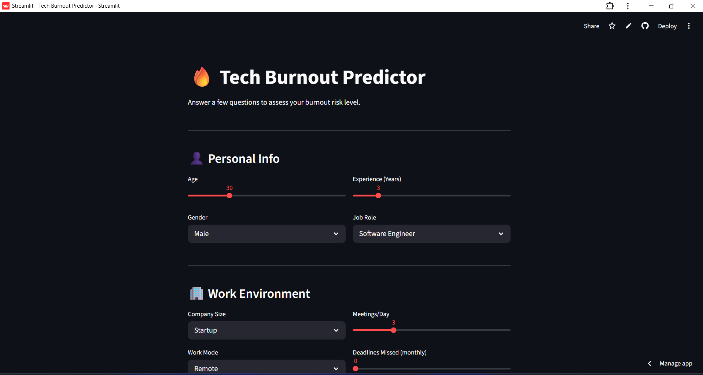
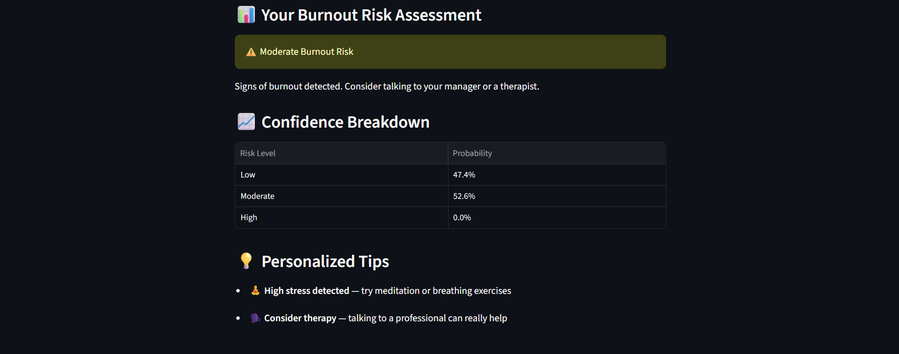

# 🔥 Tech Burnout Predictor

A machine learning web app that predicts burnout risk levels in tech workers.

🔗 **Live Demo:** [tech-burnout-predictor.streamlit.app](https://tech-burnout-predictor.streamlit.app)

---

## 📌 Overview

Mental health in tech is a growing concern. This project analyzes data from
150,000 tech professionals to predict whether someone is at Low, Moderate,
or High risk of burnout — based on their work habits, lifestyle, and mental
health indicators.

---

## 🖼️ App Preview




---

## 📊 Dataset
- Data collected from Kaggle
- 150,000 tech worker records
- 25 features including work hours, stress level, job role, sleep, and more
- Target variable: `burnout_level` (Low / Moderate / High)

---

## ⚙️ ML Pipeline

| Step | Details |
|---|---|
| EDA | Distribution plots, correlation heatmap, boxplots |
| Preprocessing | Label encoding, one-hot encoding, StandardScaler |
| Class Imbalance | RandomUnderSampler + SMOTE |
| Model Selection | RandomizedSearchCV across 4 models |
| Best Model | Random Forest (F1 Macro = 0.94) |

---

## 🏆 Model Comparison

| Model | Best F1 (CV) |
|---|---|
| **Random Forest** | **0.9401** |
| XGBoost | 0.9335 |
| Decision Tree | 0.9113 |
| Logistic Regression | 0.9058 |

---

## 🌟 Key Findings

- **Stress level** is the #1 predictor of burnout (32% importance)
- **Depression & anxiety** together account for 24% importance
- **Work hours** matter more than work mode (Remote vs Onsite)
- **Manager support** impacts burnout more than job satisfaction
- **Age** has almost no impact on burnout risk

---

## 🛠️ Tech Stack

- Python, Pandas, NumPy
- Scikit-learn, Imbalanced-learn
- Matplotlib, Seaborn
- Streamlit

---

## 📁 Project Structure
```
burnout-predictor/
│
├── app.py                 ← Streamlit web app
├── requirements.txt       ← Dependencies
├── burnout_model.pkl      ← Trained Random Forest model
├── scaler.pkl             ← Fitted StandardScaler
└── feature_names.pkl      ← Feature names list
```

---

## 🚀 Run Locally
```bash
git clone https://github.com/MueezBukhari02/tech-burnout-predictor.git
cd tech-burnout-predictor
pip install -r requirements.txt
streamlit run app.py
```

---

## ⚠️ Known Limitations

- High burnout class has only 65 real cases in the dataset
- Despite SMOTE oversampling, High burnout prediction (F1=0.00) 
  remains unreliable due to insufficient real examples
- Model performs well for Low and Moderate burnout detection

---

## 👨‍💻 Author

**Syed Mueez Ul Hassan Bukhari**
[](https://github.com/MueezBukhari02)
[](https://www.linkedin.com/in/syedmueezulhassanbukhari/)
